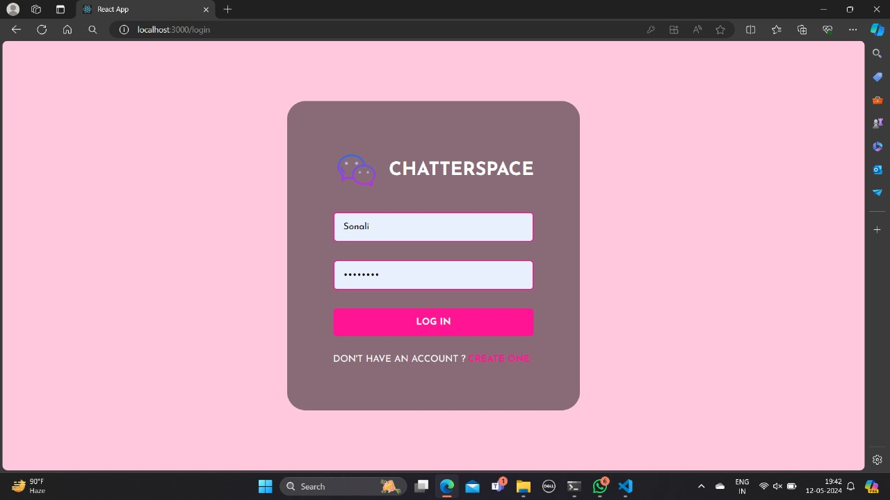
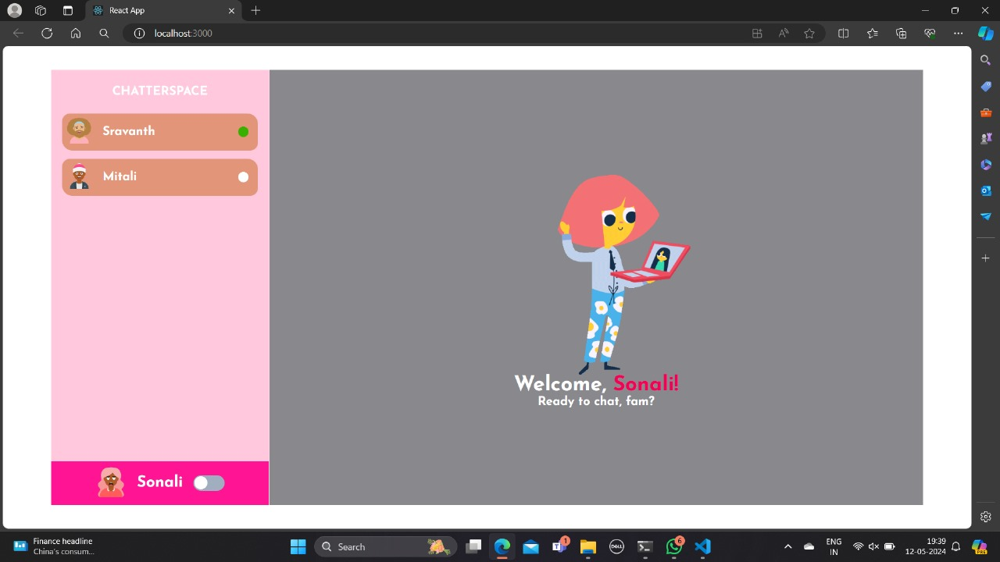

# ChatterSpace- ChatApp






## Installation Guide

### Requirements
- [Nodejs](https://nodejs.org/en/download)
- [Mongodb](https://www.mongodb.com/docs/manual/administration/install-community/)

## check git ignore 
-check git ignore file and load the dependencies

## For Frontend.
```terminal
cd client
npm run start
```
## For Backend.

Open another terminal in folder, connect mongodb in background.
```terminal
cd server
npm start
```
Here we are Done! Now go to localhost:3000 in the browser.
